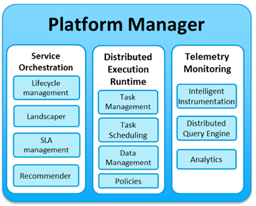

# LifecycleManagement
Platform Controller - Lifecycle Management module

[](https://opensource.org/licenses/Apache-2.0)

&copy; Atos Spain S.A. 2017

The Lifecycle Management module is a component of the European Project mF2C.

-----------------------

[Description](#description)

[Component architecture](#component-architecture)

[Installation Guide](#installation-guide)

[Usage Guide](#usage-guide)

[Relation to other mF2C components](#relation-to-other-mf2c-components)

[Resources managed by this component](#resources-managed-by-this-component)

[LICENSE](#license)

-----------------------

### Description

The Lifecycle Management component is responsible for managing the lifecycle of the applications to be executed by the mF2C infrastructure.
This includes the initialization, the submission and the termination of these applications, among other operations.

The Lifecycle Manager can deploy services in agents with Docker, Docker Swarm and Kubernetes. Services deployed in Docker engines can be normal docker images or _docker-compose_ files.

-----------------------

### Component architecture

This component is part of the Platform Manager's Service Orchestration module:



-----------------------

### Installation Guide

#### 1. Requirements

This component can be installed as a standalone component, or as part of mF2C. To install it as a standalone component you just need the following:

1. [Docker](https://docs.docker.com/install/)

**Dockerfile** content:

```
FROM python:3.4-alpine
ADD . /code
WORKDIR /code
RUN pip install -r requirements.txt
EXPOSE 46000
CMD ["python", "app.py"]
```

To install as part of mF2C see **mF2C/mF2C** [repository](https://github.com/mF2C/mF2C)

To run the component without Docker, you will need the following:

1. Python 3.4

#### 2. Install

###### 2.1. Get Docker image from **Docker Hub**

1. Pull image:

```bash
docker pull mf2c/lifecycle
```

2. Run application and expose port `46000`:

```bash
sudo docker run -p 46000:46000 mf2c/lifecycle
```

Read [Usage Guide](#usage-guide) section to see how to properly start the component.

###### 2.2. Get repository

1. Clone / download repository

```bash
git clone https://github.com/mF2C/LifecycleManagement.git
```

2. Go to LifecycleManagement folder

```bash
cd LifecycleManagement
```

3. Build application:

```bash
sudo docker build -t lm-app .
```

4. Run application and expose port `46000`:

```bash
sudo docker run -p 46000:46000 lm-app
```

<p style="color:red; font-weight: bold">NOTE: Read next section to see how to properly start the component.</p>

-----------------------

### Usage Guide

1. Start the Lifecycle Management module with access to the docker socket ('-v /var/run/docker.sock:/var/run/docker.sock')

```bash
sudo docker run --env -v /var/run/docker.sock:/var/run/docker.sock -p 46000:46000 mf2c/lifecycle
```
  - Available environment variables:
    - **STANDALONE_MODE** `False` if working in an agent with other mF2C components; `True` if working without external dependencies (except docker)
    - **CIMI_URL**
    - **HOST_IP** Machine's IP address: needed by the lifecycle when deploying services in a set of agents (to see if an agent is in local host or if it is in another machine)
    - **CIMI_USER** CIMI user
    - **WORKING_DIR_VOLUME** _docker-compose.yml_ folder
    - **URL_PM_SLA_MANAGER** URL of the Platform Manager - SLA Manager; e.g. https://192.168.192.192:46030
    - **URL_AC_SERVICE_MNGMT** URL of the Agent Controller - QoS Providing; e.g. https://192.168.192.192:46200/api/service-management
    - **URL_AC_USER_MANAGEMENT** URL of the Agent Controller - User Management; e.g. https://192.168.192.192:46300/api/v1/user-management
    - **URL_PM_RECOM_LANDSCAPER** URL of the Platform Manager - Landscaper/Recommender; e.g. http://192.168.252.41:46020/mf2c
    - **K8S_MASTER**
    - **K8S_PROXY**
    - **K8S_NAMESPACE**
    - **DOCKER_SOCKET**
    - **DOCKER_SWARM**

  - List of methods:
    - **/api/v2**
      - GET _get rest api service status_
    - **/api/v2/lm**
      - POST _QoS Enforcement / UM notifications_
    - **/api/v2/lm/agent-config**
      - GET _get agent's lifecycle configuration: docker, docker-swarm, kubernetes, ..._
    - **/api/v2/lm/agent-um**
      - GET _get agent's current user-profile and sharing-model (from 'local' User Management module)_
      - PUT _updates user-profile current number of applications running_
    - **/api/v2/lm/service-instance/<string:service_instance_id>**
      - GET _get service instance / all service instances (from cimi)_
      - PUT _Starts / stops / restarts a service instance  //  starts a job in COMPSs_
      - DELETE _terminates a service instance; deletes service instance (from cimi)_
    - **/api/v2/lm/service-instances/<string:service_instance_id>/report**
      - GET _get service instance report_
    - **/api/v2/lm/service**
      - POST _Submits a service and gets a service instance (new version)_
    - **/api/v2/lm/service-instance-int** (_internal calls_)
      - POST _Submits a service in a mF2C agent_
      - PUT _starts / stops ... a service in a mF2C agent; start-job_


2. After launching the Lifecycle Management module, the REST API services can be accessed at port 46000:
    - List of services (json): _https://localhost:46000/api/v2/lm
    - List of services (swagger ui): _https://localhost:46000/api/v2/lm.html_

3. View the following examples:
   - [COMPSs application](resources/LifecycleExample_01.md): Complete lifecycle of a service based on COMPSs
   - [GitLab application](resources/LifecycleExample_02.md): Deployment of a service based on a docker-compose file

4. See also the user guide that can be found in https://github.com/mF2C/Documentation/blob/master/documentation/user_guide/api.rst

-----------------------

### Relation to other mF2C components

The **Lifecycle** Management module is connected with the following mF2C components:

- Is called by the following modules / components:
    - _User Management_: Lifecycle receives warnings from the User Management when the mF2C applications use more resources than allowed by the users
    - _SLA Manager_: -

- Makes calls to the following modules / components:
    - _Recommender_ & _Landscaper_: The Lifecycle gets from this component the list of all available agents and resources where a service can be deployed
    - _Service Management_: The Lifecycle calls the Service Management module to know which of the agents from a list can be used to deploy a service
    - _User Management_: Lifecycle interacts with the User Management module to get the profile and sharing resources defined by the user in a device
    - _Distributed Execution Runtime / COMPSs_:
    - _SLA Manager_: Lifecycle calls the SLA Manager to start, stop and terminate the SLA agreement monitoring process


-----------------------

### Resources managed by this component

**service_instance**

```json
{
  "id": URI,
  "user": string,
  "device_id": string,
  "device_ip": string,
  "service": string,
  "agreement": string,
	"status": string,
  "service_type": string,
  "agents": [
    {
      "agent": resource-link,
      "app_type": string,
      "url": "192.168.1.31",
      "ports": [],
      "agent_param": string,
      "container_id": string,
      "status": string,
      "num_cpus": int,
      "allow": boolean,
      "master_compss": boolean
    }
  ]
}
```

**Service_instance**'s properties:
- **user** : user that launches the service
- **device_id** : device that launches the service
- **device_ip** : device's IP address
- **service** : service identifier (service running in the agents)
- **agreement** : agreement identifier
- **status** : status of the service
- **service_type** : type of service: docker, docker-compose, docker-swarm, kubernetes
- Agents that are running this service:
  - **url** : agent IP address
  - **status** : status of the container or docker swarm service
  - **ports** : ports used / exposed by the container or docker swarm service
  - **container_id** : id from docker container or docker swarm service
  - **allow** : agent is allowed to deploy the container / service (set by the _service manager_ component)
  - **master_compss** : true if this agent is master (COMPSs)
  - **app_type** : type of service: docker, docker-compose, docker-swarm, kubernetes

-----------------------

### LICENSE

The Lifecycle application is licensed under [Apache License, version 2](LICENSE.TXT).
