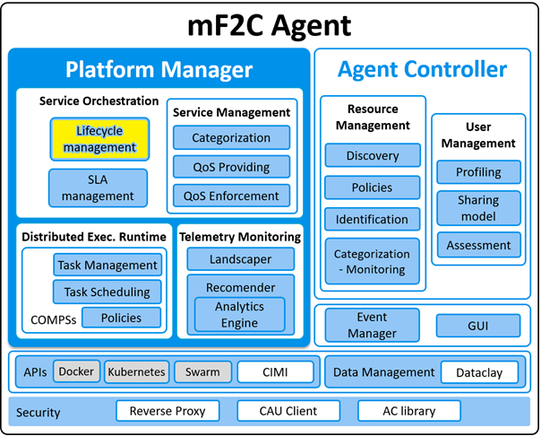

# LifecycleManagement
Platform Controller - Lifecycle Management module

[](https://opensource.org/licenses/Apache-2.0)

&copy; Atos Spain S.A. 2017

The Lifecycle Management module is a component of the European Project mF2C.

-----------------------

[Description](#description)

[Component architecture](#component-architecture)

[Installation Guide](#installation-guide)

[Usage Guide](#usage-guide)

[Relation to other mF2C components](#relation-to-other-mf2c-components)

-----------------------

### Description

The Lifecycle Management component is responsible for managing the lifecycle of the applications to be executed by the mF2C infrastructure.
This includes the initialization, the submission and the termination of these applications, among other operations.

-----------------------

### Component architecture

This component is part of the Platform Manager's Service Orchestration module:



-----------------------

### Installation Guide

#### 1. Requirements

1. [Docker](https://docs.docker.com/install/)
2. [mF2C CIMI server](https://github.com/mF2C/cimi)

Dockerfile content:

```
FROM python:3.4-alpine
ADD . /code
WORKDIR /code
RUN pip install -r requirements.txt
EXPOSE 46000
CMD ["python", "app.py"]
```

#### 2. Install & Launch with Docker

1. [Install and launch the CIMI server](https://github.com/mF2C/cimi/tree/master/_demo) / or connect to a remote CIMI server

###### 2.1. From 'mf2c/lifecycle'...

1. Pull image:

```bash
docker pull mf2c/lifecycle
```

2. Run application and expose port `46000`:


```bash
sudo docker run -p 46000:46000 mf2c/lifecycle
```

Read [Usage Guide](#usage-guide) section to see how to properly start the component.

###### 2.2. From mF2C repository...

1. Clone / download repository

```bash
git clone https://github.com/mF2C/LifecycleManagement.git
```

2. Go to LifecycleManagement folder

```bash
cd LifecycleManagement
```

3. Build application:

```bash
sudo docker build -t lm-app .
```

4. Run application and expose port `46000`:

```bash
sudo docker run -p 46000:46000 lm-app
```

Read next section to see how to properly start the component.

-----------------------

### Usage Guide

1. Create a user in CIMI
2. Start the Lifecycle Management module with access to the docker socket ('-v /var/run/docker.sock:/var/run/docker.sock')

```bash
sudo docker run --env -v /var/run/docker.sock:/var/run/docker.sock -p 46000:46000 lm-app
```
  - Available environment variables:
    - **STANDALONE_MODE** `False` if working in an agent with other mF2C components; `True` if working without external dependencies (except docker)
    - **CIMI_URL**
    - **HOST_IP** Machine's IP address (needed to see if lifecycle is in local host or if it is in another agent/machine)
    - **CIMI_USER** CIMI user
    - **CIMI_PASSWORD** CIMI password
    - **URL_PM_SLA_MANAGER** URL of the Plantform Manager - SLA Manager; e.g. https://192.168.192.192:46030
    - **URL_AC_QoS_PROVIDING** URL of the Agent Controller - QoS Providing; e.g. https://192.168.192.192:46200/api/service-management
    - **URL_AC_USER_MANAGEMENT** URL of the Agent Controller - User Management; e.g. https://192.168.192.192:46300/api/v1/user-management

3. After launching the Lifecycle Management module, the REST API services can be accessed at port 46000:
    - List of services (json): _https://localhost:46000/api/v1/lifecycle_
    - List of services (swagger ui): _https://localhost:46000/api/v1/lifecycle.html_
4. View the following examples:
   - [example 1](LifecycleExample_01.md): (complete lifecycle of a service): `LifecycleExample.md`
   - [GitLab application](LifecycleExample_02.md): Deployment of a service based on a docker-compose file

-----------------------

### Relation to other mF2C components

The Lifecycle Management module is connected with the following mF2C components:

- Is called by the following modules / components:
    - User Management: it receives warnings from the User Management when the mF2C applications use more resources than allowed by the users

- Makes calls to the following modules / components:
    - User Management:
    - QoS:
    - Landscaper:
    - Recommender:
    - Distributed Execution Runtime:
    - SLA Manager:
    - Service Management:
